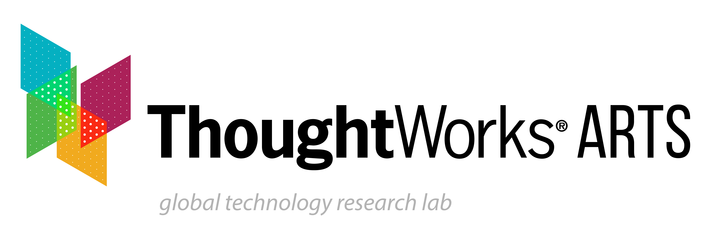

# ThoughtWorks Arts Website
Code which powers [thoughtworksarts.io](thoughtworksarts.io).

## Commands
```
grunt serve
grunt build --dist
grunt deploy
```

## How to create blog or newsletter items

### 1. Create the markdown file
- Create a new `md` file in [posts folder](source/app/_posts) or [newsletters folder](source/app/_newsletters).

- Title lengths should be between 2-3 lines, possibly 4 but certainly not 5 or more.

- Slugs should be created manually from the title, but trim them to keep them [neat and readable](https://en.wikipedia.org/wiki/Clean_URL#Slug).

### 2. Add the excerpt divider
- Add the string `<!--excerpt-ends-->` to separate the preview excerpt for the [listings](https://thoughtworksarts.io/blog/) [pages](https://thoughtworksarts.io/newsletters/) from the full article content.

- Here is an example of what a [neat and inviting listing preview](/readme/listing-example.jpg) looks like, and here is the [code behind it](https://raw.githubusercontent.com/thoughtworksarts/thoughtworksarts.github.io/source/app/_posts/2020-11-10-new-york-times-features-output.markdown).

- As per the above example, use the following format:

```
   [first sentence]

   

   [second sentence]

   <!--excerpt-ends-->

   [rest of content]
```

- To achieve this, sometimes it may be necessary to add the excerpt separator mid-paragarph. This is fine and supported as per [this example](https://raw.githubusercontent.com/thoughtworksarts/thoughtworksarts.github.io/source/app/_posts/2020-03-31-rachel-uwa-school-machines-making-make-believe.markdown).

### 3. Add images or downloads
- If needed, create corresponding subfolder in [post images](source/app/images/posts) or [newsletter images](source/app/images/newsletters) folder with matching name to the `md` file.

- Once you have that you can use the following code blocks to render images:  
  
```
   Image with no caption, link or alt text:
   
         

   Image with caption, link and alt text:
   
         

   Image with alt text only:
   
         
```

### 4. Add video
- If needed, use the following code blocks to render video:

```
   Youtube:
   
      

   Vimeo:

      

   With captions:

      

      
```

### 5. Check social preview
- By default, a social preview image will be pulled automatically from the first image, youtube or vimeo found on the post.

- You can check this by inspecting the sourcve and looking for the `<meta property="og:image" content="/image.jpg" />` element (any relative URLs here are converted to absolute URLs on publishing.)

- If you want to override this image for this post, add an image property to the jekyll front mater, as in [this example](https://raw.githubusercontent.com/thoughtworksarts/thoughtworksarts.github.io/source/app/_posts/2018-04-09-thoughtworks-arts-exhibition-spring-break-armory-week.markdown).

### 6. Verify after publishing
- Once the post is published, make sure it looks good on the live site.

- Make sure the social previews are working using the [facebook](https://developers.facebook.com/tools/debug/) and / or [twitter validator](https://cards-dev.twitter.com/validator) tools.